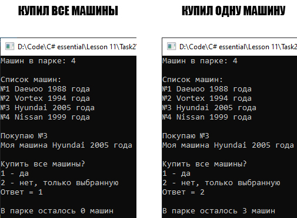

# Lesson11_task2
>Используя Visual Studio, создайте проект по шаблону Console Application.  
Создайте класс CarCollection<T>. Реализуйте в простейшем приближении возможность использования его экземпляра для создания парка машин. 
Минимально требуемый интерфейс взаимодействия с экземпляром, должен включать метод добавления машин с названием машины и года ее выпуска, индексатор для получения значения элемента по указанному индексу и свойство только для чтения для получения общего количества элементов.  
Создайте метод удаления всех машин автопарка. 

Подытог: вот такенный майндфак на выходе
>
